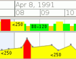
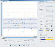

<ul class="toc">
<li><a href="#funded">funded research projects</a></li>
<!-- <li><a href="#student">supervised student projects</a></li> -->
<li><a href="#scientific-collaborators">scientific collaborators</a></li>
<li><a href="#reviewing">reviewing</a></li>
<li><a href="#events_organized">conference and workshop organization</a></li>
</ul>

## funded research projecwqqts {#funded}

since 09/2020
: [{: align='right'}](https://research.fhstp.ac.at/en/projects/sonivis-data-analytics-using-sonification-and-visualization)
**SoniVis&mdash;Data Analytics using Sonification and Visualization**{: .project} \\
Austrian Science Fund (FWF) \\
[St.&nbsp;P&ouml;lten University of Applied Sciences, Institute of Creative\Media/Technologies](https://www.fhstp.ac.at/icmt){: .external}, Austria \\
[project webpage](https://research.fhstp.ac.at/en/projects/sonivis-data-analytics-using-sonification-and-visualization){: .external}

since 01/2020
: [{: align='right'}](https://research.fhstp.ac.at/en/projects/regiobiograph)
**RegioBioGraph**{: .project} \\
NÖ Forschungs- und Bildungsges.m.b.H. (NFB), FTI \\
[St.&nbsp;P&ouml;lten University of Applied Sciences, Institute of Creative\Media/Technologies](https://www.fhstp.ac.at/icmt){: .external}, Austria \\
[project webpage](https://research.fhstp.ac.at/en/projects/regiobiograph){: .external}

since 11/2018
: [{: align='right'}](https://research.fhstp.ac.at/en/projects/remocap-lab)
**ReMoCap-Lab&mdash;Laboratory for Capturing Motion and Augmenting Environment in Motor Rehabilitation**{: .project} \\
Austrian Federal Ministry for Digital And Economic Affairs (BMDW), COIN \\
[St.&nbsp;P&ouml;lten University of Applied Sciences, Center for Digital Health Innovation](https://cdhi.fhstp.ac.at/en){: .external}, Austria \\
[project webpage](https://research.fhstp.ac.at/en/projects/remocap-lab){: .external}

since 05/2020
: **Egozentrierte Netzwerkkarte digital!**{: .project} \\
Federal Ministry for Digital and Economic Affairs (BMDW), Digital Innovation Hub DIH-OST \\
[St.&nbsp;P&ouml;lten University of Applied Sciences, Institute of Creative\Media/Technologies](https://www.fhstp.ac.at/icmt){: .external}, Austria \\
[project webpage](https://dih-ost.at/product/egozentrierte-netzwerkkarte-digital/){: .external}

10/2018 &ndash; 12/2018
: [{: align='right'}](https://research.fhstp.ac.at/en/projects/schreibcoachvis)
**SchreibCoachVis&mdash;visualization for linguistic science and training**{: .project} \\
Austrian Research Promotion Agency (FFG), Innovationsscheck \\
[St.&nbsp;P&ouml;lten University of Applied Sciences, Institute of Creative\Media/Technologies](https://www.fhstp.ac.at/icmt){: .external}, Austria \\
[project webpage](https://research.fhstp.ac.at/en/projects/schreibcoachvis){: .external}

01/2018 &ndash; 12/2018
: [{: align='right'}](https://www.netidee.at/contractvis)
**ContractVis&mdash;the visual assistant for the fine print**{: .project} \\
Internet Foundation Austria (IPA), netidee, prj2116 \\
[St.&nbsp;P&ouml;lten University of Applied Sciences, Institute of Creative\Media/Technologies](https://www.fhstp.ac.at/icmt){: .external}, Austria \\
[project webpage](https://www.netidee.at/contractvis){: .external}

01/2015 &ndash; 12/2018
: [{: align='right'}](http://www.validproject.at/)
**VALID&mdash;Visual Analytics in Data-driven Journalism**{: .project} \\
Austrian Ministry for Transport, Innovation and Technology (BMVIT), IKT der Zukunft \\
[St.&nbsp;P&ouml;lten University of Applied Sciences, Institute of Creative\Media/Technologies](https://www.fhstp.ac.at/icmt){: .external}, Austria \\
[project webpage](http://www.validproject.at/){: .external}

08/2013 &ndash; 07/2018
: [{: align='right'}](https://research.fhstp.ac.at/en/projects/kava-time-how-man-and-machine-analyze-data)
**KAVA-Time&mdash;Knowledge-Assisted Visual Analytics Methods for Time-Oriented Data**{: .project} \\
Austrian Science Fund (FWF) \\
[St.&nbsp;P&ouml;lten University of Applied Sciences, Institute of Creative\Media/Technologies](https://www.fhstp.ac.at/icmt){: .external}, Austria \\
[project webpage](https://research.fhstp.ac.at/en/projects/kava-time-how-man-and-machine-analyze-data){: .external}

03/2015 &ndash; 12/2015
: [{: align='right'}](https://research.fhstp.ac.at/en/projects/visual-analytics-for-real-estate-platform)
**Visual Analytics for Real Estate Platform**{: .project} \\
Austrian Research Promotion Agency (FFG), Innovationsscheck plus \\
[St.&nbsp;P&ouml;lten University of Applied Sciences, Institute of Creative\Media/Technologies](https://www.fhstp.ac.at/icmt){: .external}, Austria \\
[project webpage](https://research.fhstp.ac.at/en/projects/visual-analytics-for-real-estate-platform){: .external}

01/2013 &ndash; 12/2013
: [{: align='right'}](http://www.cvast.tuwien.ac.at/node/550)
**CVAST&mdash;Centre for Visual Analytics Science and Technology**{: .project} \\
Austrian Federal Ministry of Economy, Family and Youth in the exceptional Laura Bassi Centres of Excellence initiative \\
[Vienna University of Technology, Institute of Software Technology and Interactive Systems](http://www.isis.tuwien.ac.at/){: .external}, Austria \\
[project webpage](http://www.cvast.tuwien.ac.at/node/550){: .external}

04/2011 &ndash; 12/2013
: [{: align='right'}](https://www.cvast.tuwien.ac.at/projects/hypovis)
**HypoVis&mdash;Modeling Hypotheses with Visual Analytics Methods to Analyze the Past and Forecast the Future**{: .project} \\
Austrian Science Fund (FWF) \\
[Vienna University of Technology, Institute of Software Technology and Interactive Systems](http://www.isis.tuwien.ac.at/){: .external}, Austria \\
[project webpage](https://www.cvast.tuwien.ac.at/projects/hypovis){: .external}

09/2010 &ndash; 05/2011
: [{: align='right'}](http://ieg.ifs.tuwien.ac.at/projects/HorizonVis/)
**HorizonVis&mdash;Interactive Visual Exploration of Multivariate Medical Measurements in Diabetes Care**{: .project} \\
Sparkling Science initiative of the Federal Ministry of Science and Research \\
[Vienna University of Technology, Institute of Software Technology and Interactive Systems](http://www.isis.tuwien.ac.at/){: .external}, Austria \\
[project webpage](http://ieg.ifs.tuwien.ac.at/projects/HorizonVis/){: .external}

03/2008 &ndash; 03/2011
: [{: align='right'}](http://ieg.ifs.tuwien.ac.at/projects/VisuExplore/)
**VisuExplore&mdash;Gaining New Medical Insights through Visual Exploration**{: .project} \\
Austrian Research Promotion Agency (FFG), Bridge Program \\
[Danube University Krems, Department of Information &amp; Knowledge Engineering](http://www.donau-uni.ac.at/en/department/ike/){: .external}, Austria \\
[project webpage](http://ieg.ifs.tuwien.ac.at/projects/VisuExplore/){: .external}

10/2008 &ndash; 02/2009
: **TimeCockpit&mdash;Interactive Visualization of Sensor Data for Time Tracking**{: .project} \\
Austrian Research Promotion Agency (FFG), Innovationsscheck \\
[Danube University Krems, Department of Information &amp; Knowledge Engineering](http://www.donau-uni.ac.at/en/department/ike/){: .external}, Austria

04/2006 &ndash; 02/2008
: **etBlogAnalysis&mdash;Analysis of Tourism Weblogs**{: .project} \\
Austrian Research Promotion Agency (FFG), Industrial Competence Network anet \\
Krems Research Forschungsgesellschaft, Austria

04/2006 &ndash; 02/2008
: **etValidierung&mdash;Validation of Tourism Websites**{: .project} \\
Austrian Research Promotion Agency (FFG), Industrial Competence Network anet \\
Krems Research Forschungsgesellschaft, Austria

12/2004 &ndash; 06/2005
: **TAI&mdash;Measuring Value Added by Day Trip Tourism**{: .project} \\
Austrian Research Promotion Agency (FFG), Industrial Competence Network anet \\
Krems Research Forschungsgesellschaft, Austria

[top](#top){: .top_link}

<!--
  <h2 id="student">supervised student projects (not up-to-date)</h2>

  <dl>
    <dt>05/2011 &ndash; 04/2012</dt>
    <dd>
      
      
A Comparison of Static and Dynamic Visualizations for Time-Oriented Data (M.Sc. thesis)

      
Animated scatter plot and two variants of small multiples were
      experimentally compared in an extended version of the TimeRider prototype.

      <a href="http://ieg.ifs.tuwien.ac.at/projects/timerider/" class="external">project webpage</a>
    </dd>

    <dt>01/2011 &ndash; 11/2011</dt>
    <dd>
      
       
Empirical Evaluation of a Visualization Technique with Semantic Zoom (M.Sc. thesis)

      
The effectiveness of two visualization techniques for time series
      data in combination with qualitative abstractions was compared in a
      controlled experiment.

      <a href="http://ieg.ifs.tuwien.ac.at/projects/semzoom/" class="external">project webpage</a>
    </dd>

    <dt>02/2010 &ndash; 10/2010</dt>
    <dd>
      
      
TimeRider&mdash;Visualizing Patient Cohorts by Animated Scatter Plots (ctd.)

      
The TimeRider prototype is extended with features to synchronize
      patient histories, select patients, save settings, further usability
      improvements.

      <a href="http://ieg.ifs.tuwien.ac.at/projects/timerider/" class="external">project webpage</a>
    </dd>

    <dt>03/2009 &ndash; 11/2009</dt>
    <dd>
      
       
Semantic Zoom of Time-oriented Quantitative Data

      
A reusable software component for the qualitatively enriched
      and space-efficient visualization of time-oriented data based on the
      prefuse toolkit.

      <a href="http://ieg.ifs.tuwien.ac.at/projects/semzoom/" class="external">project webpage</a>
    </dd>

    <dt>01/2009 &ndash; 07/2009</dt>
    <dd>
      
      
TimeRider&mdash;Visualizing Patient Cohorts by Animated Scatter Plots

      
A prototypical visualization system allows medical analysts to
      explore the dynamics of patient cohorts. It provides a scatter plot to
      view the relationship between two variables and animation to understand
      development over time. Further it tackles irregular sampling and data
      wear, which arise from the medical scenario.

      <a href="http://ieg.ifs.tuwien.ac.at/projects/timerider/" class="external">project webpage</a>
    </dd>
  </dl>

[top](#top){: .top_link}
-->

## scientific collaborators

* [Silvia Miksch](http://www.ifs.tuwien.ac.at/~silvia/){: .external}, TU Wien, Austria
* [Wolfgang Aigner](http://mc.fhstp.ac.at/people/wolfgang-aigner){: .external}, St. Pölten University of Applied Sciences, Austria
* [Tim Lammarsch](http://www.lammarsch.de/publications.html){: .external}, (now) independent scholar and consultant, Austria
* Catherine Plaisant & Ben Shneiderman, University of Maryland, USA
* Natalia & Gennady Andrienko, Fraunhofer Institute IAIS, Germany
* Daniel Keim, University of Konstanz, Germany

[top](#top){: .top_link}

## reviewing

2021
: IEEE VIS Short PapersPC
: Workshop on Visual Analytics in Healthcare (VAHC)PC
: Eurographics Workshop on Visual Analytics (EuroVA)PC &ndash; 2 papers
: Workshop on Big Data Visual Exploration and Analytics (BigVis)PC
: IEEE VIS Full PapersE &ndash; 2 papers
: SAGE Information VisualizationE

2020
: IEEE VIS Short PapersPC &ndash; 3 papers
: IEEE Visual Analytics Science and Technology (VAST)E
: IEEE Information Visualization (InfoVis)E
: IEEE Pacific Visualization Symposium (PacificVis)E
: Eurographics Conference on Visualization (EuroVis)2
: Workshop on Big Data Visual Exploration and Analytics (BigVis)PC

2019
: Workshop on Visual Analytics in Healthcare (VAHC)PC
: ACM Conference on Human Factors in Computing Systems (CHI) &ndash; 3 late-breaking&nbsp;workE
: Applied Clinical Informatics (ACI)E

2018
: Workshop on Evaluation and Beyond (BELIV)PC
: IEEE Information Visualization (InfoVis) &ndash; 2 papersE
: IEEE Visual Analytics Science and Technology (VAST)2
: ACM Conference on Human Factors in Computing Systems (CHI) &ndash; 2 papers, 1 late-breaking&nbsp;workE
: IEEE Transactions on Visualization and Computer Graphics (TVCG)E
: Digital Humanities AustriaPC
: Forschungsforum der &ouml;sterreichischen Fachhochschulen (FFH)E

2017
: Eurographics Workshop on Visual Analytics (EuroVA)PC
: Workshop on Visual Analytics in Healthcare (VAHC)PC
: IEEE Information Visualization (InfoVis) &ndash; 2 papersE
: IEEE Visual Analytics Science and Technology (VAST)2
: Eurographics Conference on Visualization (EuroVis)E
: IEEE Pacific Visualization Symposium (PacificVis)E
: ACM Conference on Human Factors in Computing Systems (CHI)E
: IEEE Transactions on Visualization and Computer Graphics (TVCG)2
: SAGE Information VisualizationE
: Taylor & Francis Journal of Decision SystemsE
: Forum MedientechnikPC
: Digital Humanities AustriaPC
: Forschungsforum der &ouml;sterreichischen Fachhochschulen (FFH)PC

2016
: Eurographics Workshop on Visual Analytics (EuroVA)PC
: IEEE Visual Analytics Science and Technology (VAST)E
: IEEE Information Visualization (InfoVis)2
: Eurographics Conference on Visualization (EuroVis) &ndash; 2 papersE,2
: ACM Conference on Human Factors in Computing Systems (CHI)2
: IEEE Transactions on Visualization and Computer Graphics (TVCG)E
: PLOS ONEE
: MDPI InformaticsE
: IEEE Pacific Visualization Symposium (PacificVis) NotesE

2015
: Workshop on Visual Analytics in Healthcare (VAHC)PC
: IEEE International Symposium on Big Data Visual Analytics (BDVA)PC
: Eurographics Conference on Visualization (EuroVis)E
: IEEE Information Visualization (InfoVis)E
: IEEE Visual Analytics Science and Technology (VAST) &ndash; 2 papers2
: IEEE Transactions on Visualization and Computer Graphics (TVCG)2
: Journal of the American Medical Informatics Association (JAMIA)E
: The Visual Computer (TVCJ)E
: International Conference on Information Visualization Theory and Applications (IVAPP)2
: International Conferences in Central Europe on Computer Graphics, Visualization and Computer Vision (WSCG)E

2014
: IEEE Visual Analytics Science and Technology (VAST)E
: IEEE Information Visualization (InfoVis) &ndash; 3 papers2
: EuroVis Short PapersPC
: IEEE Transactions on Visualization and Computer Graphics (TVCG) &ndash; 2 papersE,2
: ACM Conference on Human Factors in Computing Systems (CHI)E
: Journal of the American Medical Informatics Association, special issue on "Visual Analytics"E
: it&mdash;Information Technology, special issue on "Visual Analytics"2
: IBM Journal of Research and Development, special issue on "Multimedia and Visual Analytics"E
: Forum MedientechnikPC
: Forschungsforum der &ouml;sterreichischen FachhochschulenPC
: International Symposium on Visual Information Communication and Interaction (VINCI) &ndash; 2 papers2<dd>

2013
: Conference on Artificial Intelligence in MEdicine (AIME)E
: Eurographics Conference on Visualization (EuroVis)1
: Information Visualization Theory and Applications (IVAPP)2

2012
: IEEE Transactions on Visualization and Computer Graphics (TVCG)E
: IEEE Information Visualization (InfoVis) &ndash; 1 paperE
: IEEE Information Visualization (InfoVis) &ndash; 2 papers1,2
: IEEE Visual Analytics Science and Technology (VAST)2
: Eurographics Conference on Visualization (EuroVis)2
: VAST 2012 Challenge &ndash; 2 contributionsE
: eHealth conference, Vienna1

2011
: IEEE Information Visualization (InfoVis)2
: IEEE Visual Analytics Science and Technology (VAST)2

2010
: IEEE Information Visualization (InfoVis)2
: IEEE Visual Analytics Science and Technology (VAST)2
: IEEE Pacific Visualization Symposium (PacificVis) &ndash; 2 papers1,2
: IEEE International Conference on Data Mining (ICDM)1
: eHealth conference, Vienna1

2009
: ACM Symposium on User Interface Software and Technology (UIST)2

PC...programme committee member 
E...external reviewer/invitation from editor or programme committee member 
1...in cooperation with Silvia Miksch 
2...in cooperation with Wolfgang Aigner 

  <a class="top_link" href="#top">top</a>

  <h2 id="events_organized">conference and workshop organization</h2>

  <dl>
    <dt>10/2021</dt>
    <dd>
      
 Workshop on Audio-Visual Analytics – Towards a Research Agenda for Integrating Sonification and Visualization

      at <a href="http://ieeevis.org/year/2021/info/workshops" class="external">IEEE VIS 2021</a> 
      <em>Member of the organizing committee</em>
    </dd>
	
    <dt>09/2017</dt>
    <dd>
      
OpenGLAM.at Kulturhackathon

      <a href="https://www.fhstp.ac.at/" class="external">St.&nbsp;P&ouml;lten University of Applied Sciences</a>,
      <a href="http://www.noe.gv.at/" class="external">Federal State of Lower Austria</a>,
      <a href="http://www.donau-uni.ac.at/" class="external">Donau Universität Krems</a>,
      <a href="https://www.ait.ac.at/" class="external">AIT</a>, etc. 
      <em>Member of the organizing committee</em>
    </dd>

    <dt>06/2012</dt>
    <dd>
      
Eurographics Conference on Visualization
        (EuroVis)

      <a href="http://www.cg.tuwien.ac.at/eurovis2012/"
        class="external">Vienna University of Technology, Institute of
        Computer Graphics and Algorithms</a>, <a
        href="http://www.uni-linz.ac.at/index_e.htm" class="external">VRVis
        Center for Virtual Reality and Visualization Research</a>, and
      <a href="http://www.ocg.at/" class="external">Austrian Computer
        Society (OCG)</a>  <em>Student volunteer</em>
    </dd>

    <dt>07/2008</dt>
    <dd>
      
BEST Course on Technology &ldquo;Biomedical
        Engineering: Stimulate Your Nerves!&rdquo;

      <a href="http://bestvienna.at/" class="external">BEST Vienna</a> in
      cooperation with <a href="http://www.tuwien.ac.at/" class="external">Vienna
        University of Technology</a>  <em>Member of the organizing
        committee</em>
    </dd>

    <dt>09/2007</dt>
    <dd>
      
International Conference on Music Information
        Retrieval (ISMIR)

      <a href="http://www.informatik.tuwien.ac.at/" class="external">Vienna
        University of Technology</a>, <a
        href="http://www.uni-linz.ac.at/index_e.htm" class="external">Johannes
        Kepler University</a>, <a
        href="http://www.ofai.at/research/impml/" class="external">Austrian
        Research Institute for Artificial Intelligence (OFAI)</a>, and <a
        href="http://www.ocg.at/" class="external">Austrian Computer
        Society (OCG)</a> 
        <em>Student volunteer</em>
    </dd>

    <dt>07/2007</dt>
    <dd>
      
Symposium &ldquo;Blogs in Tourism&rdquo;

      <a href="http://www.kremsresearch.at/" class="external">Krems
        Research Forschungsgesellschaft</a> in cooperation with <a
        href="http://www.kitzbuehel.com/de/" class="external">Kitzb&uuml;hel
        Tourism</a> 
        <em>Member of the organizing committee</em>
    </dd>

    <dt>07/2007</dt>
    <dd>
      
BEST Course on Technology &ldquo;Space
        Engineering&rdquo;

      <a href="http://www.bestvienna.at/" class="external">BEST Vienna</a>
      in cooperation with <a href="http://www.tuwien.ac.at/"
        class="external">Vienna University of Technology</a>  
      <em>Member of the organizing committee</em>
    </dd>

    <dt>07/2006</dt>
    <dd>
      
BEST Course on Technology &ldquo;Universal
        Design - Architecture for All&rdquo;

      <a href="http://www.bestvienna.at/" class="external">BEST Vienna</a>
      in cooperation with <a href="http://www.tuwien.ac.at/"
        class="external">Vienna University of Technology </a> 
      <em>Member of the organizing committee</em>
    </dd>

    <dt>07/2005</dt>
    <dd>
      
BEST Course on Technology &ldquo;Universal
        Design - Architecture for everyone&rdquo;

      <a href="http://www.bestvienna.at/" class="external">BEST Vienna</a>
      in cooperation with <a href="http://www.tuwien.ac.at/"
        class="external">Vienna University of Technology</a>  
      <em>Member of the organizing committee</em>
    </dd>

    <dt>09/2003</dt>
    <dd>
      
Workshop &ldquo;Curriculum development: the use
        of new tools for teaching/learning&rdquo;

      <a href="http://www.bestvienna.at/" class="external">BEST Vienna</a>
      in cooperation with the European Union thematic network <a
        href="http://etnet.vub.ac.be/etnet21.asp" class="external">ETNET21</a>
       
      <em>Head of the organizing committee</em>
    </dd>
  </dl>

  <a class="top_link" href="#top">top</a>
