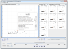

<ul class="toc">
<li><a href="#funded">funded research projects</a></li>
<li><a href="#student">supervised student projects</a></li>
<li><a href="#reviewing">reviewing</a></li>
<li><a href="#events_organized">conference and workshop organization</a></li>
</ul>

  <h2 id="funded">funded research projects</h2>

  <dl>
    <dt>since 01/2015</dt>
    <dd>
      
      
VALID&mdash;Visual Analytics in Data-driven Journalism

       Austrian Ministry for Transport, Innovation and Technology (BMVIT), IKT der Zukunft 
      <a href="http://english.fhstp.ac.at/research/institutes_areas/media_technologies" class="external">St.&nbsp;P&ouml;lten
          University of Applied Sciences, Institute of Creative\Media/Technologies</a>, Austria 
      <a href="http://www.validproject.at/" class="external">project webpage</a>
    </dd>

    <dt>since 08/2013</dt>
    <dd>
      
      
KAVA-Time&mdash;Knowledge-Assisted Visual Analytics Methods for Time-Oriented Data

      Austrian Science Fund (FWF) 
      <a href="http://english.fhstp.ac.at/research/institutes_areas/media_technologies" class="external">St.&nbsp;P&ouml;lten
	  University of Applied Sciences, Institute of Creative\Media/Technologies</a>, Austria 
      <a href="http://mc.fhstp.ac.at/projects/kava-time" class="external">project webpage</a>
    </dd>

    <dt>01/2013 &ndash; 12/2013</dt>
    <dd>
      
      
CVAST&mdash;Centre for Visual Analytics Science and Technology

       Austrian Federal Ministry of Economy, Family and Youth in the exceptional Laura Bassi Centres of Excellence initiative 
      <a href="http://www.isis.tuwien.ac.at/" class="external">Vienna University of Technology,
      Institute of Software Technology and Interactive Systems</a>, Austria 
      <a href="http://www.cvast.tuwien.ac.at/node/550" class="external">project webpage</a>
    </dd>

    <dt>04/2011 &ndash; 12/2013</dt>
    <dd>
      
      
HypoVis&mdash;Modeling Hypotheses with Visual Analytics Methods to Analyze the Past
      and Forecast the Future

      Austrian Science Fund (FWF) 
      <a href="http://www.isis.tuwien.ac.at/" class="external">Vienna University of Technology,
      Institute of Software Technology and Interactive Systems</a>, Austria 
      <a href="http://www.cvast.tuwien.ac.at/ieg-projects/hypovis" class="external">project webpage</a>
    </dd>

    <dt>09/2010 &ndash; 05/2011</dt>
    <dd>
      
      
HorizonVis&mdash;Interactive Visual Exploration of Multivariate Medical Measurements in Diabetes Care

      Sparkling Science initiative of the Federal Ministry of Science and Research 
      <a href="http://www.isis.tuwien.ac.at/" class="external">Vienna University of Technology,
      Institute of Software Technology and Interactive Systems</a>, Austria 
      <a href="http://ieg.ifs.tuwien.ac.at/projects/HorizonVis/" class="external">project webpage</a>
    </dd>

    <dt>03/2008 &ndash; 03/2011</dt>
    <dd>
      
       
VisuExplore&mdash;Gaining New Medical Insights through Visual Exploration

      Austrian Research Promotion Agency (FFG), Bridge Program 
      <a href="http://www.donau-uni.ac.at/en/department/ike/" class="external">Danube University Krems,
      Department of Information &amp; Knowledge Engineering</a>, Austria 
      <a href="http://ieg.ifs.tuwien.ac.at/projects/VisuExplore/" class="external">project webpage</a>
    </dd>

    <dt>10/2008 &ndash; 02/2009</dt>
    <dd>
       
TimeCockpit&mdash;Interactive Visualization of Sensor Data for Time Tracking

      Austrian Research Promotion Agency (FFG), Innovationsscheck 
      <a href="http://www.donau-uni.ac.at/en/department/ike/" class="external">Danube University Krems,
      Department of Information &amp; Knowledge Engineering</a>, Austria
    </dd>

    <dt>04/2006 &ndash; 02/2008</dt>
    <dd>
       
etBlogAnalysis&mdash;Analysis of Tourism Weblogs

      Austrian Research Promotion Agency (FFG), Industrial Competence Network anet 
      Krems Research Forschungsgesellschaft, Austria
    </dd>

    <dt>04/2005 &ndash; 02/2008</dt>
    <dd>
       
etValidierung&mdash;Validation of Tourism Websites

      Austrian Research Promotion Agency (FFG), Industrial Competence Network anet 
      Krems Research Forschungsgesellschaft, Austria
    </dd>

    <dt>12/2004 &ndash; 06/2005</dt>
    <dd>
       
TAI&mdash;Measuring Value Added by Day Trip Tourism

      Austrian Research Promotion Agency (FFG), Industrial Competence Network anet 
      Krems Research Forschungsgesellschaft, Austria
    </dd>
  </dl>

  <a class="top_link" href="#top">top</a>

  <h2 id="student">supervised student projects</h2>

  <dl>
    <dt>05/2011 &ndash; 04/2012</dt>
    <dd>
      
      
A Comparison of Static and Dynamic Visualizations for Time-Oriented Data (M.Sc. thesis)

      
Animated scatter plot and two variants of small multiples were
      experimentally compared in an extended version of the TimeRider prototype.

      <a href="http://ieg.ifs.tuwien.ac.at/projects/timerider/" class="external">project webpage</a>
    </dd>

    <dt>01/2011 &ndash; 11/2011</dt>
    <dd>
      
       
Empirical Evaluation of a Visualization Technique with Semantic Zoom (M.Sc. thesis)

      
The effectiveness of two visualization techniques for time series
      data in combination with qualitative abstractions was compared in a
      controlled experiment.

      <a href="http://ieg.ifs.tuwien.ac.at/projects/semzoom/" class="external">project webpage</a>
    </dd>

    <dt>02/2010 &ndash; 10/2010</dt>
    <dd>
      
      
TimeRider&mdash;Visualizing Patient Cohorts by Animated Scatter Plots (ctd.)

      
The TimeRider prototype is extended with features to synchronize
      patient histories, select patients, save settings, further usability
      improvements.

      <a href="http://ieg.ifs.tuwien.ac.at/projects/timerider/" class="external">project webpage</a>
    </dd>

    <dt>03/2009 &ndash; 11/2009</dt>
    <dd>
      
       
Semantic Zoom of Time-oriented Quantitative Data

      
A reusable software component for the qualitatively enriched
      and space-efficient visualization of time-oriented data based on the
      prefuse toolkit.

      <a href="http://ieg.ifs.tuwien.ac.at/projects/semzoom/" class="external">project webpage</a>
    </dd>

    <dt>01/2009 &ndash; 07/2009</dt>
    <dd>
      
      
TimeRider&mdash;Visualizing Patient Cohorts by Animated Scatter Plots

      
A prototypical visualization system allows medical analysts to
      explore the dynamics of patient cohorts. It provides a scatter plot to
      view the relationship between two variables and animation to understand
      development over time. Further it tackles irregular sampling and data
      wear, which arise from the medical scenario.

      <a href="http://ieg.ifs.tuwien.ac.at/projects/timerider/" class="external">project webpage</a>
    </dd>
  </dl>

  <a class="top_link" href="#top">top</a>

  <h2 id="reviewing">reviewing</h2>

  <dl>
    <dt>2017</dt>
    <dd>IEEE Pacific Visualization Symposium (PacificVis)E</dd>
    <dd>ACM Conference on Human Factors in Computing Systems (CHI)E</dd>
    <dt>2016</dt>
    <dd>Eurographics Workshop on Visual Analytics (EuroVA)PC</dd>
    <dd>IEEE Visual Analytics Science and Technology (VAST)E</dd>
    <dd>IEEE Information Visualization (InfoVis)2</dd>
    <dd>Eurographics Conference on Visualization (EuroVis) &ndash; 2 papersE,2</dd>
    <dd>ACM Conference on Human Factors in Computing Systems (CHI)2</dd>
    <dd>IEEE Transactions on Visualization and Computer Graphics (TVCG)E</dd>
    <dd>PLOS ONEE</dd>
    <dd>MDPI InformaticsE</dd>
    <dd>IEEE Pacific Visualization Symposium (PacificVis) NotesE</dd>
    <dt>2015</dt>
    <dd>Workshop on Visual Analytics in Healthcare (VAHC)PC</dd>
    <dd>IEEE International Symposium on Big Data Visual Analytics (BDVA)PC</dd>
    <dd>Eurographics Conference on Visualization (EuroVis)E</dd>
    <dd>IEEE Information Visualization (InfoVis)E</dd>
    <dd>IEEE Visual Analytics Science and Technology (VAST) &ndash; 2 papers2</dd>
    <dd>IEEE Transactions on Visualization and Computer Graphics (TVCG)2</dd>
    <dd>Journal of the American Medical Informatics Association (JAMIA)E</dd>
    <dd>The Visual Computer (TVCJ)E</dd>
    <dd>International Conference on Information Visualization Theory and Applications (IVAPP)2
    <dd>International Conferences in Central Europe on Computer Graphics, Visualization and Computer Vision (WSCG)E</dd>
    <dt>2014</dt>
    <dd>IEEE Visual Analytics Science and Technology (VAST)E</dd>
    <dd>IEEE Information Visualization (InfoVis) &ndash; 3 papers2</dd>
    <dd>EuroVis Short PapersPC</dd>
    <dd>IEEE Transactions on Visualization and Computer Graphics (TVCG) &ndash; 2 papersE,2</dd>
    <dd>ACM Conference on Human Factors in Computing Systems (CHI)E</dd>
    <dd>Journal of the American Medical Informatics Association, special issue on "Visual Analytics"E</dd>
    <dd>it&mdash;Information Technology, special issue on "Visual Analytics"2</dd>
    <dd>IBM Journal of Research and Development, special issue on "Multimedia and Visual Analytics"E</dd>
    <dd>Forum MedientechnikPC</dd>
    <dd>Forschungsforum der &ouml;sterreichischen FachhochschulenPC</dd>
    <dd>International Symposium on Visual Information Communication and Interaction (VINCI) &ndash; 2 papers2<dd>
    <dt>2013</dt>
    <dd>Conference on Artificial Intelligence in MEdicine (AIME)E</dd>
    <dd>Eurographics Conference on Visualization (EuroVis)1</dd>
    <dd>Information Visualization Theory and Applications (IVAPP)2</dd>
    <dt>2012</dt>
    <dd>IEEE Transactions on Visualization and Computer Graphics (TVCG)E</dd>
    <dd>IEEE Information Visualization (InfoVis) &ndash; 1 paperE</dd>
    <dd>IEEE Information Visualization (InfoVis) &ndash; 2 papers1,2</dd>
    <dd>IEEE Visual Analytics Science and Technology (VAST)2</dd>
    <dd>Eurographics Conference on Visualization (EuroVis)2</dd>
    <dd>VAST 2012 Challenge &ndash; 2 contributionsE</dd>
    <dd>eHealth conference, Vienna1</dd>
    <dt>2011</dt>
    <dd>IEEE Information Visualization (InfoVis)2</dd>
    <dd>IEEE Visual Analytics Science and Technology (VAST)2</dd>
    <dt>2010</dt>
    <dd>IEEE Information Visualization (InfoVis)2</dd>
    <dd>IEEE Visual Analytics Science and Technology (VAST)2</dd>
    <dd>IEEE Pacific Visualization Symposium (PacificVis) &ndash; 2 papers1,2</dd>
    <dd>IEEE International Conference on Data Mining (ICDM)1</dd>
    <dd>eHealth conference, Vienna1</dd>
    <dt>2009</dt>
    <dd>ACM Symposium on User Interface Software and Technology (UIST)2</dd>
  </dl>

  

   PC...programme committee member 
   E...external reviewer/invitation from editor or programme committee member    
   1...in cooperation with Silvia Miksch     
   2...in cooperation with Wolfgang Aigner   
  

  <a class="top_link" href="#top">top</a>

  <h2 id="events_organized">conference and workshop organization</h2>

  <dl>
    <dt>06/2012</dt>
    <dd>
      
Eurographics Conference on Visualization
        (EuroVis)

      <a href="http://www.cg.tuwien.ac.at/eurovis2012/"
        class="external">Vienna University of Technology, Institute of
        Computer Graphics and Algorithms</a>, <a
        href="http://www.uni-linz.ac.at/index_e.htm" class="external">VRVis
        Center for Virtual Reality and Visualization Research</a>, and
      <a href="http://www.ocg.at/" class="external">Austrian Computer
        Society (OCG)</a>  <em>Student volunteer</em>
    </dd>

    <dt>07/2008</dt>
    <dd>
      
BEST Course on Technology &ldquo;Biomedical
        Engineering: Stimulate Your Nerves!&rdquo;

      <a href="http://bestvienna.at/" class="external">BEST Vienna</a> in
      cooperation with <a href="http://www.tuwien.ac.at/" class="external">Vienna
        University of Technology</a>  <em>Member of the organizing
        committee</em>
    </dd>

    <dt>09/2007</dt>
    <dd>
      
International Conference on Music Information
        Retrieval (ISMIR)

      <a href="http://www.informatik.tuwien.ac.at/" class="external">Vienna
        University of Technology</a>, <a
        href="http://www.uni-linz.ac.at/index_e.htm" class="external">Johannes
        Kepler University</a>, <a
        href="http://www.ofai.at/research/impml/" class="external">Austrian
        Research Institute for Artificial Intelligence (OFAI)</a>, and <a
        href="http://www.ocg.at/" class="external">Austrian Computer
        Society (OCG)</a> 
        <em>Student volunteer</em>
    </dd>

    <dt>07/2007</dt>
    <dd>
      
Symposium &ldquo;Blogs in Tourism&rdquo;

      <a href="http://www.kremsresearch.at/" class="external">Krems
        Research Forschungsgesellschaft</a> in cooperation with <a
        href="http://www.kitzbuehel.com/de/" class="external">Kitzb&uuml;hel
        Tourism</a> 
        <em>Member of the organizing committee</em>
    </dd>

    <dt>07/2007</dt>
    <dd>
      
BEST Course on Technology &ldquo;Space
        Engineering&rdquo;

      <a href="http://www.bestvienna.at/" class="external">BEST Vienna</a>
      in cooperation with <a href="http://www.tuwien.ac.at/"
        class="external">Vienna University of Technology</a>  
      <em>Member of the organizing committee</em>
    </dd>

    <dt>07/2006</dt>
    <dd>
      
BEST Course on Technology &ldquo;Universal
        Design - Architecture for All&rdquo;

      <a href="http://www.bestvienna.at/" class="external">BEST Vienna</a>
      in cooperation with <a href="http://www.tuwien.ac.at/"
        class="external">Vienna University of Technology </a> 
      <em>Member of the organizing committee</em>
    </dd>

    <dt>07/2005</dt>
    <dd>
      
BEST Course on Technology &ldquo;Universal
        Design - Architecture for everyone&rdquo;

      <a href="http://www.bestvienna.at/" class="external">BEST Vienna</a>
      in cooperation with <a href="http://www.tuwien.ac.at/"
        class="external">Vienna University of Technology</a>  
      <em>Member of the organizing committee</em>
    </dd>

    <dt>09/2003</dt>
    <dd>
      
Workshop &ldquo;Curriculum development: the use
        of new tools for teaching/learning&rdquo;

      <a href="http://www.bestvienna.at/" class="external">BEST Vienna</a>
      in cooperation with the European Union thematic network <a
        href="http://etnet.vub.ac.be/etnet21.asp" class="external">ETNET21</a>
       
      <em>Head of the organizing committee</em>
    </dd>
  </dl>

  <a class="top_link" href="#top">top</a>
